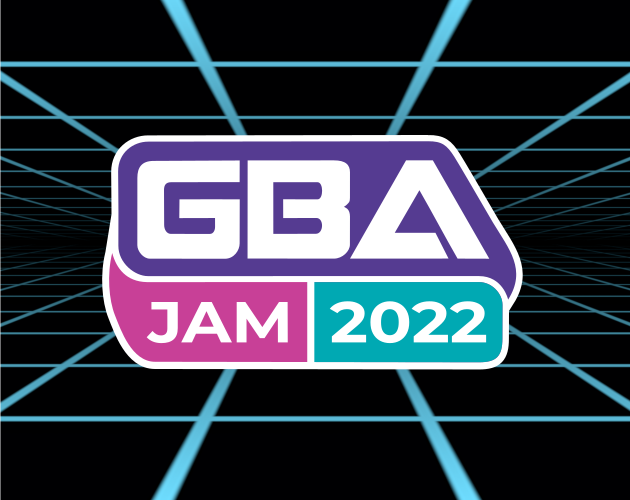

The **GBA Jam 2022** was a homebrew competition hosted by the [gbadev.net](https://gbadev.net) community to celebrate the Game Boy Advance development scene. Contestants had 3 months (from August 1st 2022 to November 1st 2022) to develop something new running on the GBA, using whatever tools they wanted.

The competition was hosted at [itch.io/jam/gbajam22](https://itch.io/jam/gbajam22).

To learn more about GBA development, visit [gbadev.net](https://gbadev.net) and join our [Discord](https://discord.io/gbadev).

This page collects every entry submitted, providing the final released ROMs and the sources.

## Downloads

- Full releases compilation (includes ROMs, screenshots, sources, ..): [gbajam22.zip](https://github.com/gbajam22/gbajam22.github.io/archive/refs/tags/final.zip)

## Acknowledgements

### Organisers and Judges

pmprog, GValiente, exelotl, avivace, skylyrac, Jono Shields, klomp 

### Donators

gbdev community, Pocket Pulp, RST Games, Incube8 Games, GValiente, Inciaradible, WolfCrow, ahmadmanga, Magic Bottle, Anonymous, pmprog, copyrat90, Quentin-dev, LostImmortal, tempest, JoaoBaptMG, akouzoukoss, lugbucket, lifning, AtsushiHdez, Sorcier, Juxxec, wackou , 3DSage

### Sponsors

  <a href="https://www.epilogue.co/" target="_blank"> </a> 

## Results

The winners, alongside full leaderboards will be announced [here](https://gbajam22.github.io/results)

## Games

### A Rushed Hack Job

&nbsp;   
by Pyro_Pyro, Music by Nikku4211  
[Project Page](https://pyro-pyro.itch.io/a-rushed-hack-job) |
[ROM File](https://gbajam22.github.io/entries/a-rushed-hack-job/ARushedHackJob_jam.gba) |
[Source](https://git.sr.ht/~pyropyro/A-Rushed-Hack-Job)

### Attack of Voxelburg

&nbsp;   &nbsp;   
by nuclear  
[Project Page](https://nuclear.itch.io/attack-on-voxelburg) |
[ROM File](https://gbajam22.github.io/entries/attack-on-voxelburg/voxelburg_jam.gba) |
[Source](https://github.com/MutantStargoat/voxelburg)

### Bugtris

&nbsp;   &nbsp;   
by NotImplementedLife  
[Project Page](https://notimplementedlife.itch.io/bugtris) |
[ROM File](https://gbajam22.github.io/entries/bugtris/Bugtris_jam.gba) |
[Source](https://github.com/NotImplementedLife/Bugtris)

### Chocolate Hunter Runa

&nbsp;   &nbsp;   
by Lsh0426  
[Project Page](https://lsh0426.itch.io/chocolate-hunter-runa) |
[ROM File](https://gbajam22.github.io/entries/chocolate-hunter-runa/chocolate_hunter_runa_jam.gba) |
[Source](https://github.com/Runa457/chocolate_hunter_runa)

### Coin Fall

&nbsp;   &nbsp;   
by 3DSage  
[Project Page](https://3dsage.itch.io/coin-fall) |
[ROM File](https://gbajam22.github.io/entries/coin-fall/Coin_Fall_jam.gba)

### Collie Defence

&nbsp;   &nbsp;   
by vayan  
[Project Page](https://xvayan.itch.io/collie-defence) |
[ROM File](https://gbajam22.github.io/entries/collie-defence/collie-defence_jam.gba) |
[Source](https://github.com/vayan/collie-defence)

### Gerbil Space Program

&nbsp;   &nbsp;   
by Origamiscienceguy, n67094, Nikku4211  
[Project Page](https://n67094.itch.io/gerbil-space-program) |
[ROM File](https://gbajam22.github.io/entries/gerbil-space-program/GSP_jam.gba) |
[Source](https://github.com/n67094/GSP)

### Glacia Dungeon

&nbsp;   &nbsp;   
by NotImplementedLife  
[Project Page](https://notimplementedlife.itch.io/glaciadungeon) |
[ROM File](https://gbajam22.github.io/entries/glaciadungeon/GlaciaDungeon_jam.gba) |
[Source](https://github.com/NotImplementedLife/GlaciaDungeon)

### gnoq

&nbsp;   
by Bergasms  
[Project Page](https://bergasms.itch.io/gnoq) |
[ROM File](https://gbajam22.github.io/entries/gnoq/Gnoq_jam.gba) 

### Green Memories

&nbsp;   
by Tengukaze Studio  
[Project Page](https://tengukaze.itch.io/green-memories-gba) |
[ROM File](https://gbajam22.github.io/entries/green-memories-gba/GREENMEMORIES_jam.gba)

### Hero Core

&nbsp;   &nbsp;   
by evanbowman  
[Project Page](https://evanbowman.itch.io/hero-core-gba-port) |
[ROM File](https://gbajam22.github.io/entries/hero-core-gba-port/HEROCORE_jam.gba) |
[Source](https://github.com/evanbowman/Hero-port-gba)

### Hexes

&nbsp;   &nbsp;   
by Dania Rifki  
[Project Page](https://kaleidosium.itch.io/hexes) |
[ROM File](https://gbajam22.github.io/entries/hexes/HEXES_jam.gba) |
[Source](https://github.com/EigenlightArts/HEXES)

### Kankandara No Mori - Forest of the Kankandara

&nbsp;   &nbsp;   
by brave_orakio  
[Project Page](https://brave-orakio.itch.io/kankandara-no-moriforest-of-the-kankandara) |
[ROM File](https://gbajam22.github.io/entries/kankandara-no-moriforest-of-the-kankandara/kankandara_no_mori_jam.gba)

### Lane

&nbsp;   &nbsp;   
by setsquare  
[Project Page](https://setsquare.itch.io/lane) |
[ROM File](https://gbajam22.github.io/entries/lane/Lane_jam.gba) |
[Source](https://github.com/corwinkuiper/lane)

### MineboyAdvance

&nbsp;   &nbsp;   
by sulsadood  
[Project Page](https://sulsadood.itch.io/mineboyadvance) |
[ROM File](https://gbajam22.github.io/entries/mineboyadvance/MineBoyAdvance_jam.gba) |
[Source](https://github.com/sulsadood/MineBoyAdvance)

### Minesweeper Battle

&nbsp;   &nbsp;   
by Dewbone3  
[Project Page](https://dewbone3.itch.io/minesweeper-battle) |
[ROM File](https://gbajam22.github.io/entries/minesweeper-battle/MineSweeperBattle_jam.gba) |
[Source](https://github.com/djevvy/MineSweeper-Battle)

### Notenogram

&nbsp;   &nbsp;   
by kva64  
[Project Page](https://kva64.itch.io/notenogram) |
[ROM File](https://gbajam22.github.io/entries/notenogram/notenogram_jam.gba) |
[Source](https://notabug.org/lv10groove/notenogram)

### Nuclear Love

&nbsp;   &nbsp;   
by Jono Shields  
[Project Page](https://foopod.itch.io/nuclear-love) |
[ROM File](https://gbajam22.github.io/entries/nuclear-love/nuclear-love_jam.gba)

### Pathfinder Demo

&nbsp;   &nbsp;   
by pyroceper  
[Project Page](https://pyroceper.itch.io/pathfinder-demo) |
[ROM File](https://gbajam22.github.io/entries/pathfinder-demo/PATHFINDINGDEMO_jam.gba) |
[Source](https://github.com/pyroceper/rock_paper_shotgun_tactics)

### Pocket Paint

&nbsp;   &nbsp;   
by jroatch  
[Project Page](https://jroatch.itch.io/pocket-paint-gba) |
[ROM File](https://gbajam22.github.io/entries/pocket-paint-gba/pocket-paint-gbajam2022.gba) |
[Source](https://jroatch.itch.io/pocket-paint-gba)

### Ravenia

&nbsp;   &nbsp;   
by allalonegamez  
[Project Page](https://allalonegamez.itch.io/ravenia) |
[ROM File](https://gbajam22.github.io/entries/ravenia/pocket-paint-gbajam2022.gba)

### Stealthy Stella

&nbsp;   
by Stormplay Games  
[Project Page](https://stormplay.itch.io/stealthy-stella) |
[ROM File](https://gbajam22.github.io/entries/stealthy-stella/beatemup_jam.gba) |

### The Axe

&nbsp;   &nbsp;   
by Maximilian II  
[Project Page](https://maximilian-ii.itch.io/the-axe) |
[ROM File](https://gbajam22.github.io/entries/the-axe/theAxe_jam.gba) |
[Source](https://github.com/maximilian8181/The-Axe-GBA)

### The Enchanted Place

&nbsp;   
VideoGameStoryTime  
[Project Page](https://videogamestorytime.itch.io/the-enchanted-place) |
[ROM File](https://gbajam22.github.io/entries/the-enchanted-place/Enchanted_Jam.gba)

### Villagers Ambition

&nbsp;   
by AtsushiHdez  
[Project Page](https://atsushihdez.itch.io/villagers-ambition) |
[ROM File](https://gbajam22.github.io/entries/villagers-ambition/VillagersAmbition_jam.gba)

### Yalaxy01-Yearlysis

&nbsp;   
by MysteryStrawberry  
[Project Page](https://mysterystrawberry.itch.io/yalaxy01-yearlysis) |
[ROM File](https://gbajam22.github.io/entries/yalaxy01-yearlysis/YALAXY01_jam.gba) |
[Source](https://github.com/HusYada/YALAXY-01)
